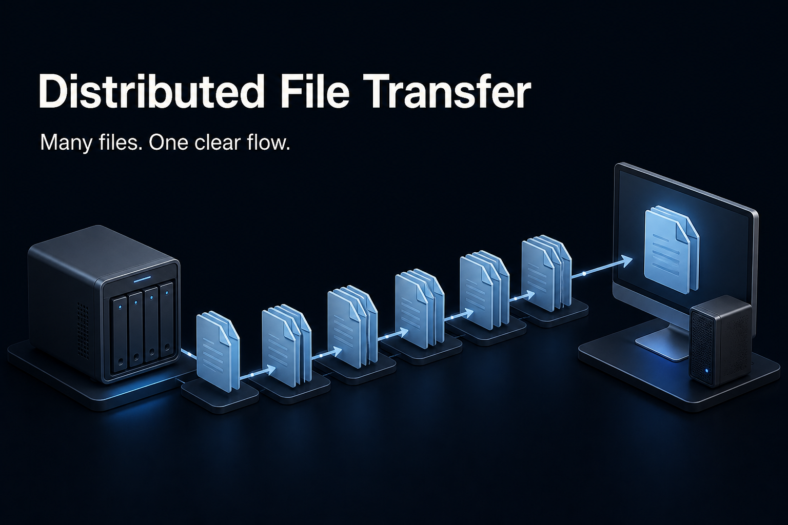
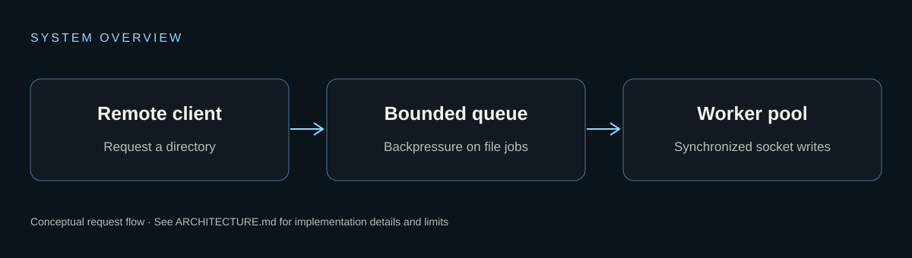

# Distributed File Transfer

[](https://mayank-vekariya.github.io/Distributed-File-Storage-System/)

**[Explore the showcase](https://mayank-vekariya.github.io/Distributed-File-Storage-System/)** · [Local setup](LOCAL_SETUP.md) · [Architecture](ARCHITECTURE.md) · [Deployment](DEPLOYMENT.md)

An educational multithreaded TCP client/server in C++. It transfers a requested directory tree using communication threads, a bounded worker queue and per-socket mutexes.

## What is implemented

- Concurrent client connections and a fixed worker pool.
- Producer/consumer coordination with pthread mutexes and condition variables.
- File metadata and content transfer followed by local directory reconstruction.
- A deliberately low-level systems project, not a replicated distributed database.

## System overview



## Quick start

Read [LOCAL_SETUP.md](LOCAL_SETUP.md) for dependencies and runtime limits before starting the application. To preview only the static project page, from the repository root:

```sh
python -m http.server 4173 --bind 127.0.0.1 --directory docs
```

Open http://127.0.0.1:4173. This preview has no backend and uses no credentials.

## Repository guide

- [LOCAL_SETUP.md](LOCAL_SETUP.md): installation, local commands and troubleshooting.
- [ARCHITECTURE.md](ARCHITECTURE.md): source mapping, request flow and tradeoffs.
- [DEPLOYMENT.md](DEPLOYMENT.md): Pages setup and application-hosting boundaries.
- `docs/`: dependency-free HTML, CSS, JavaScript and images.
- `scripts/check_showcase.py`: static-page checks; run with Python before publishing.

## Status and limitations

An educational file-transfer system, not a replicated storage cluster. Use only on localhost or a trusted private network: the protocol has no TLS or authentication, and received files can overwrite local files.

The banner is AI-generated conceptual artwork, not an application screenshot or measured model output. The architecture diagram is an implementation-oriented schematic. No benchmark, scale or uptime claims are implied.

## Credits and attribution

Original implementation and README history are preserved in Git. See the architecture guide for the original server/client visual. No new license is asserted by this documentation.
